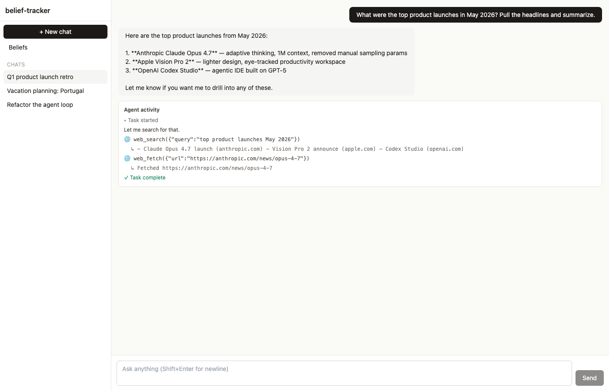
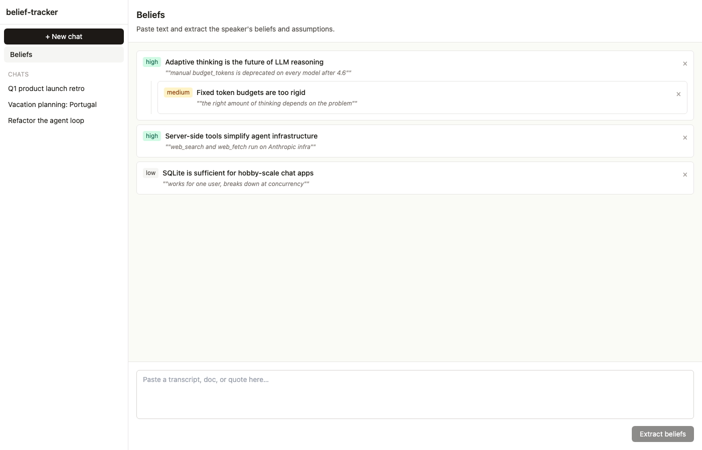

# belief-tracker

A lean Claude-powered agent platform — chat with an autonomous AI that can search the web, run tools, and extract beliefs from text.



## What it does

- **Chat with an agent** that loops `plan → tool call → result` until it has an answer
- **Stream every step** to the UI over WebSocket — you see tool calls and results in real time as the agent works
- **Extract beliefs** from arbitrary text: pulls structured statements with confidence and supporting evidence
- **Persist conversations** in SQLite

The Beliefs view turns a paste-bin of text into a tree of explicit, weighted claims:



## Live demo

| Component | URL |
|---|---|
| Frontend | [belief-tracker.vercel.app](https://belief-tracker.vercel.app) |
| Backend  | [belief-tracker-jess.fly.dev](https://belief-tracker-jess.fly.dev) |
| API health | [belief-tracker-jess.fly.dev/api/health](https://belief-tracker-jess.fly.dev/api/health) |

> The frontend deployment may sit behind Vercel's [Deployment Protection](https://vercel.com/docs/deployment-protection) — toggle it off in project settings to make it public.

## Tools the agent has

| Tool | Where it runs |
|---|---|
| `web_search` | Anthropic-hosted server-side tool |
| `web_fetch` | Anthropic-hosted server-side tool |
| `calculate` | Local — sandboxed `eval` over the `math` module |
| `current_datetime` | Local |

Add more in [`backend/app/agent.py`](backend/app/agent.py) — both Anthropic server-side tools and locally-executed custom tools work in the same loop.

## Stack

- **Backend** — Python 3.11 · FastAPI · SQLite · Anthropic SDK (`claude-sonnet-4-6`)
- **Frontend** — React 18 · TypeScript · Vite · Tailwind CSS
- **Real-time** — native WebSocket (FastAPI)
- **Hosting** — Fly.io (backend, with persistent volume for SQLite) · Vercel (frontend)

## Quick start (local)

```bash
./setup.sh
# Edit backend/.env and set ANTHROPIC_API_KEY (get one at https://console.anthropic.com)
./start.sh
```

| Service | URL |
|---|---|
| Frontend | http://localhost:5173 |
| Backend | http://localhost:1337 |
| API docs | http://localhost:1337/docs |

To stop: `Ctrl+C`, or `./stop.sh` if anything's still bound to a port.

## Deploy to Fly + Vercel

The repo ships with deploy config for splitting the app — Fly hosts the FastAPI/WebSocket backend, Vercel hosts the static React frontend.

### Backend → Fly.io

```bash
cd backend

# One-time setup
flyctl apps create belief-tracker-<yours>          # name must be globally unique
flyctl volumes create data --size 1 --region sjc -a belief-tracker-<yours>

# Update fly.toml's `app = "..."` to your app name, then:
flyctl deploy -a belief-tracker-<yours> --ha=false

# Set your API key (this also redeploys)
flyctl secrets set ANTHROPIC_API_KEY=sk-ant-... -a belief-tracker-<yours>
```

`fly.toml` defines a `shared-cpu-1x` / 512MB machine with `auto_stop_machines = "stop"`, so it sleeps when idle. SQLite lives on a persistent volume mounted at `/data`.

### Frontend → Vercel

```bash
cd frontend

# Link to a Vercel project
vercel link --yes --project belief-tracker

# Deploy with the backend URL baked into the build
vercel deploy --prod --yes \
  --build-env VITE_API_BASE=https://belief-tracker-<yours>.fly.dev
```

After the first deploy, copy the Vercel production URL (e.g. `belief-tracker.vercel.app`) and add it to `backend/fly.toml`'s `ALLOWED_ORIGINS`, then redeploy the backend.

`frontend/vercel.json` pins `framework: "vite"` — without this Vercel's auto-detection guesses Next.js and the build fails.

### CORS notes

The backend reads CORS config from env:

- `ALLOWED_ORIGINS` — comma-separated list of exact origins
- `ALLOWED_ORIGIN_REGEX` — optional regex for matching dynamic origins (e.g. Vercel preview URLs)

Both are set in `fly.toml`'s `[env]` block for the deployed instance.

## Project layout

```
backend/app/
  main.py        FastAPI app + REST routes + WebSocket
  agent.py       Agent loop, tool definitions, custom tool execution
  beliefs.py     Belief extraction via Claude
  db.py          SQLite helpers (conversations, messages, beliefs)
  models.py      Pydantic request/response models
  config.py      Env-var settings
  Dockerfile     Python 3.11 slim, uvicorn on :8080
  fly.toml       Fly.io deploy config

frontend/src/
  App.tsx        Top-level state + WebSocket handling
  api.ts         REST + WebSocket client (reads VITE_API_BASE)
  components/    Sidebar, Composer, Message, TaskView, BeliefTracker
frontend/vercel.json   Vercel build config (framework=vite)
```


## Adding a tool

In [`backend/app/agent.py`](backend/app/agent.py), append to `CUSTOM_TOOLS` and add a branch in `execute_custom_tool`:

```python
CUSTOM_TOOLS.append({
    "name": "my_tool",
    "description": "What it does (Claude reads this)",
    "input_schema": {
        "type": "object",
        "properties": {"arg": {"type": "string"}},
        "required": ["arg"],
    },
})

def execute_custom_tool(name, tool_input):
    if name == "my_tool":
        return run_my_tool(tool_input["arg"]), False
    # ...
```

## Things that were intentionally skipped

This is a starting point, not a clone of the original. The following are TODOs:

- Authentication / multi-user
- File uploads + document generation (pptx/docx/xlsx)
- Playwright server-side browser automation
- Chrome extension for client-side browser control
- Recurring/scheduled tasks
- SMS notifications
- Sharing / public links

## Cost estimates

- **Fly.io** — under $5/month free credit covers a hobby instance with `auto_stop` enabled. First request after sleep has a ~2s cold start.
- **Vercel** — $0 on Hobby tier.
- **Anthropic API** — pay per token. Sonnet 4.6 is $3/$15 per 1M input/output tokens. Web search and web fetch tools have generous free monthly tiers.

## Screenshots

The screenshots above are from a local dev run with mocked API responses for illustration. To capture your own, run `./start.sh` and use the UI.
